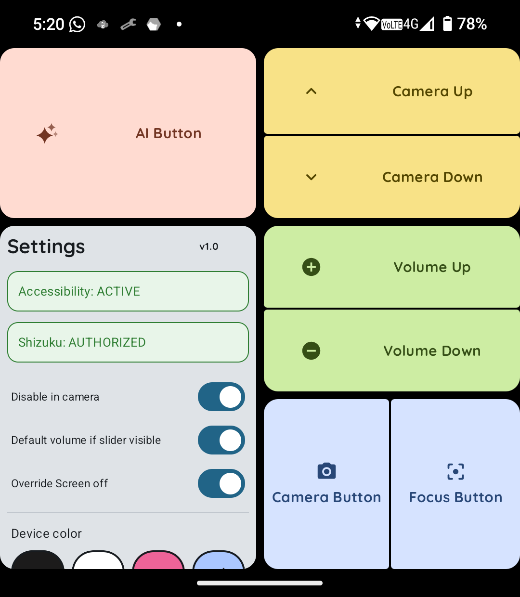
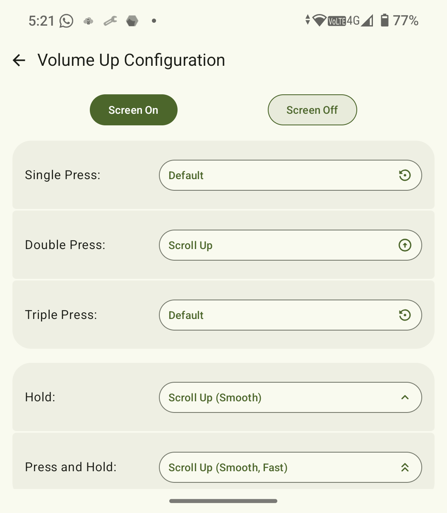
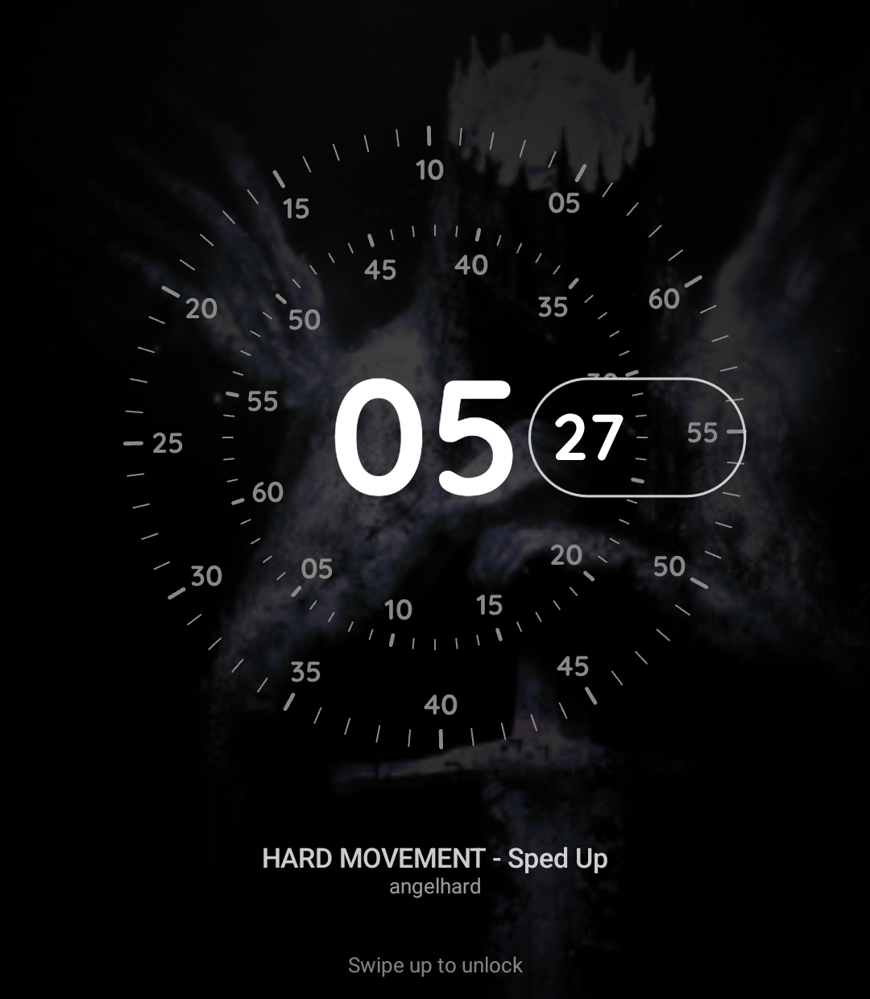
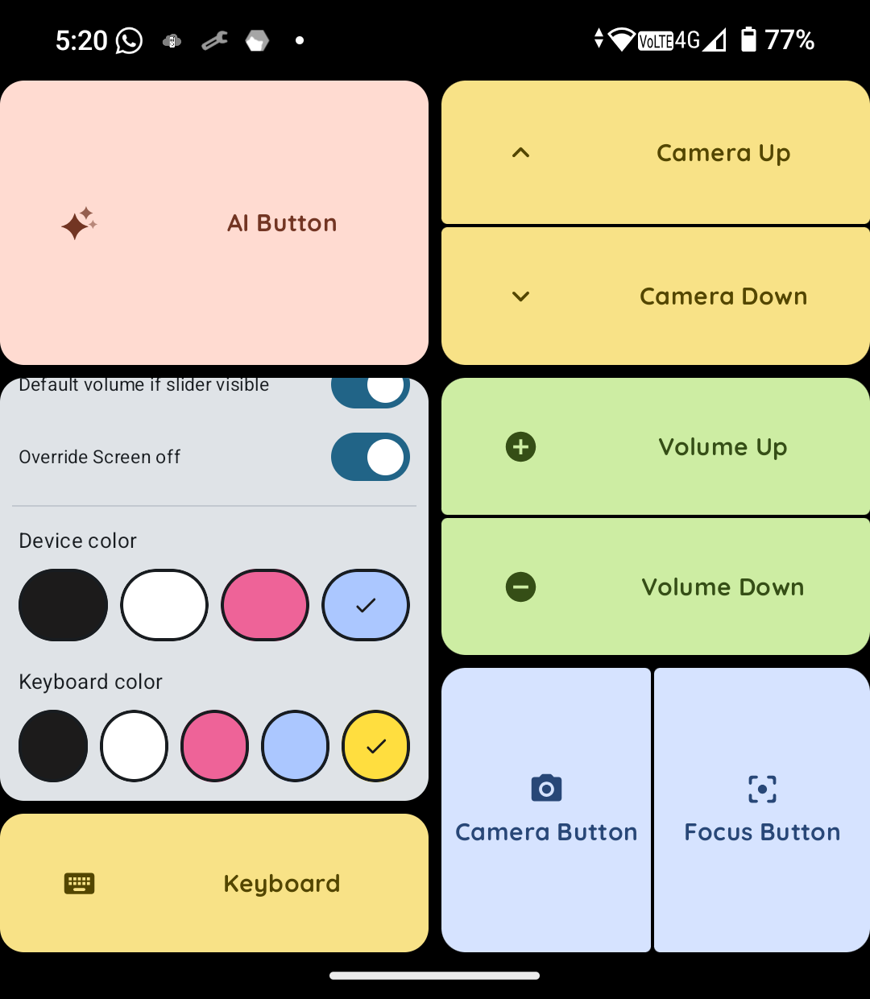
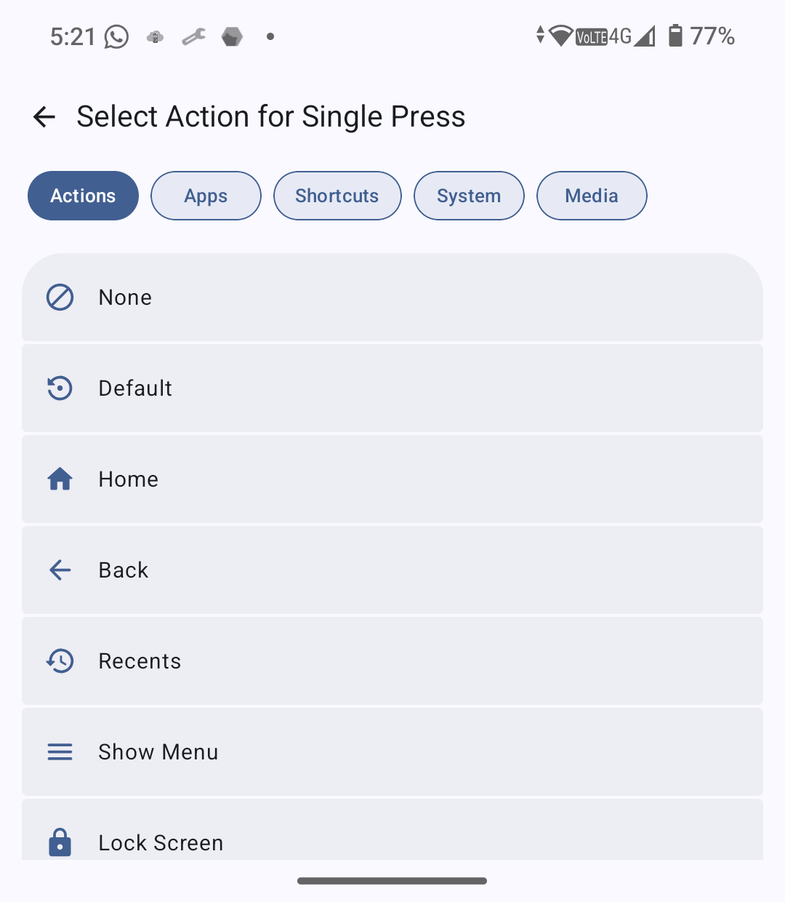
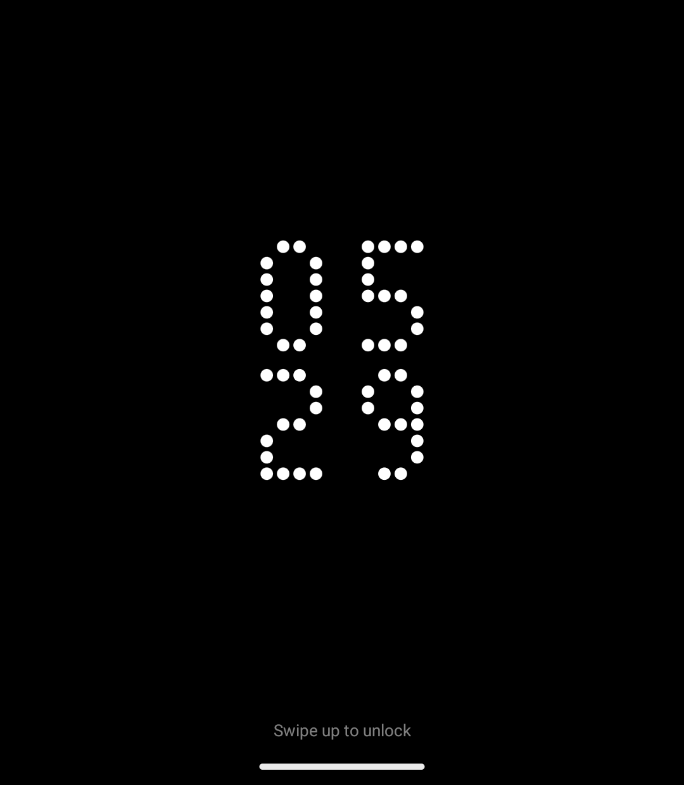
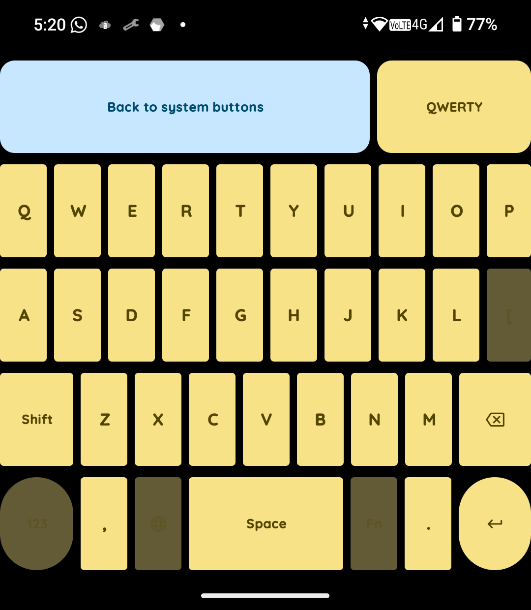
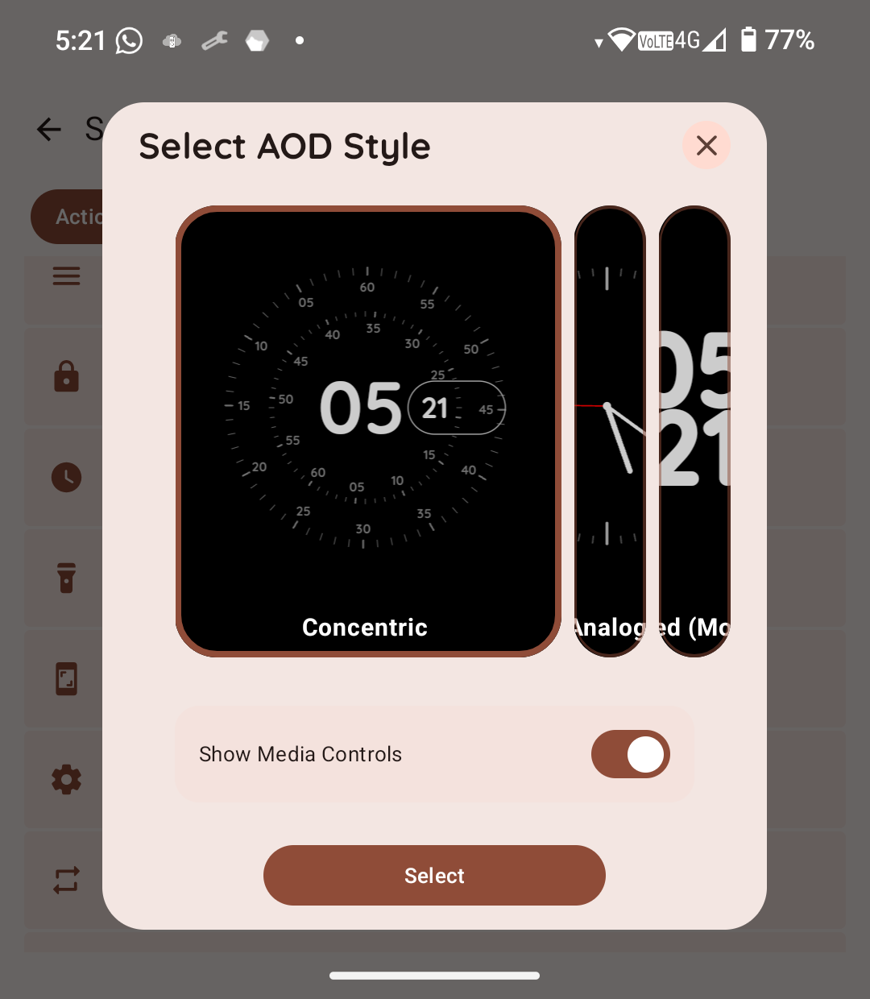
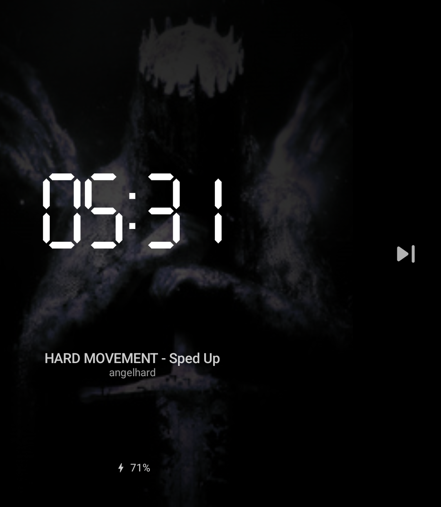
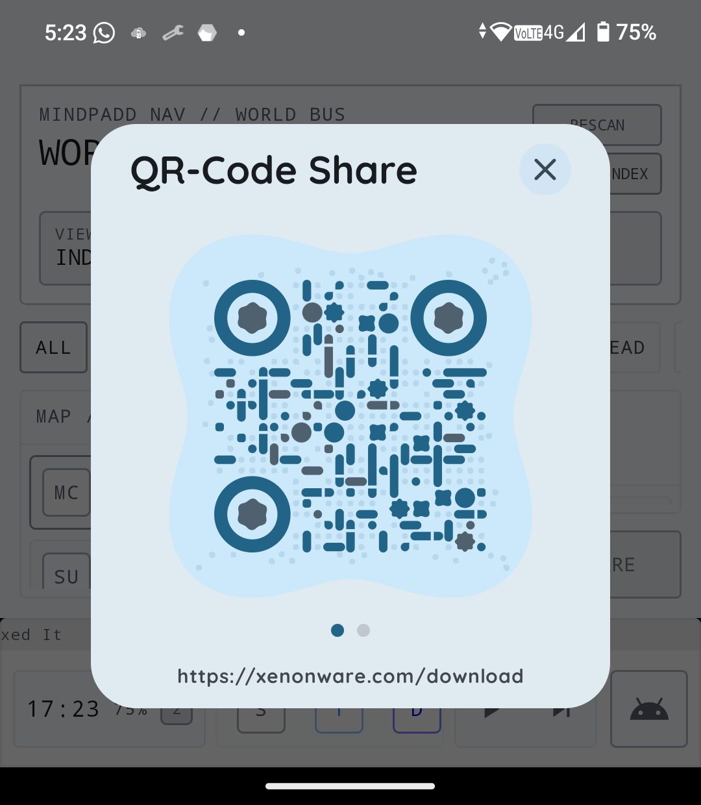

# MindControl 🧠📱

**MindControl** is a deep-integration customization tool for the iKKO MindOne. It allows you to hijack physical hardware buttons and adds an Always-On Display (AOD) with a highly customizable, media-rich alternative.

---

## 📸 Screenshots
| Main Dashboard | Button Config | AOD |
| :---: | :---: | :---: |
|  Main Dashboard |  Buttonconfig Screen |  Concentric screen with Mediaplayer |
|  Theme selector and Keyboard button |  Action selector |  Nothing Dot Stacked |
|  Keyboard Dashboard |  AOD Select Action |  Digital AOD With Media action triggerd and charning state |
| |  QR-Code dialog | |

---

## 🚀 Key Features

### 1. The Remapping Engine
Unlike standard apps, MindControl uses a low-level key filter to intercept hardware events.
*   **Hardware Supported:** Volume Rockers, Camera Shutter, Focus Sensor, dedicated AI buttons, Keyboard, and even Camera up or down movement.
*   **Multi-Trigger Support:** 
    *   `Single`, `Double`, and `Triple` click patterns.
    *   `Long Press` (Hold) and `Press and Hold` detection.
*   **Contextual States:** Map different actions for when the screen is **On** vs. **Off**.

### 2. Custom Always-On Display (AOD)
A beautiful replacement for the stock AOD, built entirely in Jetpack Compose.
*   **Visual Styles:** 
    *   `Concentric` (Pixel Watch style)
    *   `Analog` 
    *   `Modern Inline`, `Nothing Dot` and `Stacked Digital` (Stacked/Inline).
*   **Smart Features:**
    *   **Dynamic Album Art:** Renders the current track's artwork as a blurred, vignetted background.
    *   **Notification Tray:** Real-time mirroring of active app icons.
    *   **Battery Analytics:** Integrated charging animations and level tracking.

### 3. Universal Keyboard Support
MindControl provides deep integration for the physical keyboard, ensuring compatibility across different regions.
*   **Supported Layouts:** Includes `QWERTY`, `QWERTY (Spanish)`, `QWERTZ` (German/Central European), and `AZERTY` (French).
*   **Visual Mapper:** A dedicated keyboard UI allows you to visually identify and map every key on your device.

### 4. Personalization & Theming
*   **Adaptive Icons:** The launcher icon physically changes color based on your chosen theme Black/White/Pink/Blue for Icon and Device as well as Black/White/Pink/Blue/Yellow for the Keyboard.
*   **Dynamic UI:** The app interface adapts to your device's configuration, keyboard connected or disconnected.

---

## 🛠 Action Library

<b>Click to expand the 50+ available actions</b>

| Category | Actions                                                                                     |
| :--- |:--------------------------------------------------------------------------------------------|
| **Navigation** | Home, Back, Recents, Last App, Show Menu                                                    |
| **Media** | Play/Pause, Next, Previous, Stop, Fast Forward, Rewind, Step Forward/Back                   |
| **Connectivity** | WiFi Toggle, Bluetooth Toggle, Mobile Data, NFC, Location, Do Not Disturb                   |
| **System** | Flashlight, Screenshot, Lock Screen, Assistant, Power Dialog, Notifications, Quick Settings |
| **Audio/Display** | Volume Dialog, Mute Volume, Mute Mic, Brightness Up/Down, Auto-Brightness, Auto-Rotate, Rotate 360°, Cycle Sound Mode, Vibrate Ringer, Toggle AOD |
| **Advanced** | Scroll, Smooth Scroll (Fast/Normal), Copy/Cut/Paste, App Info, Google Search                |
| **Custom** | Launch App, Launch Shortcut, Speed Dial, URL Opener, QR Code Generator                      |

---

## 🏗 Technical Overview

### How it Works
1.  **Accessibility Service:** Utilizes `flagRequestFilterKeyEvents` to capture keycodes before they reach the system.
2.  **Shizuku Integration:** MindControl leverages Shizuku to execute "Secured" actions (like toggling Mobile Data or simulating input while the screen is off) without requiring Root.
3.  **Device Protected Storage:** Settings are stored in a context that is accessible **before** the user unlocks the device after a reboot, ensuring MindControl works instantly.

---

## 📥 Installation

1.  **Sideload the APK** from the [Downloads](#-downloads) section.
2.  **Enable Accessibility:** Navigate to `Settings > Accessibility > MindControl` and toggle it ON.
3.  **Grant Shizuku Access (Recommended):** For "Screen Off" actions to work reliably, ensure [Shizuku](https://shizuku.rikka.app/) is running and authorized.
4.  **Battery Optimization:** Exclude MindControl from battery optimization to prevent the system from killing the background service.

---

## 🛡 Privacy & Security
*   **No Internet Permission:** MindControl does not have access to the internet; your button presses and data stay on your device.
*   **Local Processing:** All key event filtering happens locally within the Accessibility Service.
*   **Open Source:** Transparent code for a transparent experience.

---

## 👨‍💻 Developer
*   **Company:** Xenonware
*   **Lead:** Nico (Dinico414)

---
*Disclaimer: This app uses Accessibility Services. It is not affiliated with Nothing Technology Ltd., Google LLC, or any other OEM.*
