

  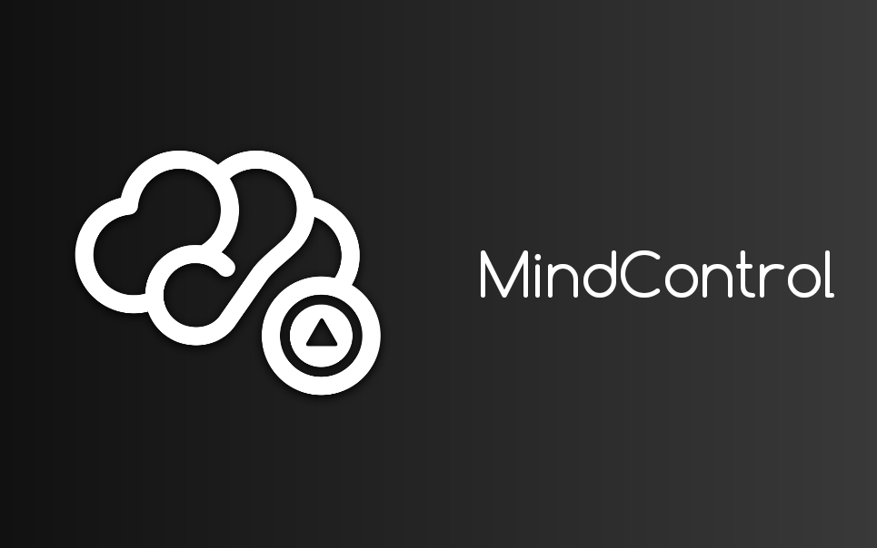

# MindControl 🧠📱
     

**MindControl** is a deep-integration hardware customization toolkit and Always-On Display (AOD) engine designed for Android devices and specifically optimized for the iKKO MindOne. It allows you to intercept and remap physical buttons, handle screen-off hardware events via privileged shell access (Shizuku or Root), dynamically adjust display aspects and DPI, and enjoy a rich, modular AOD experience.

---

## 📸 Screenshots
| Main Dashboard | Button Config | AOD |
| :---: | :---: | :---: |
| 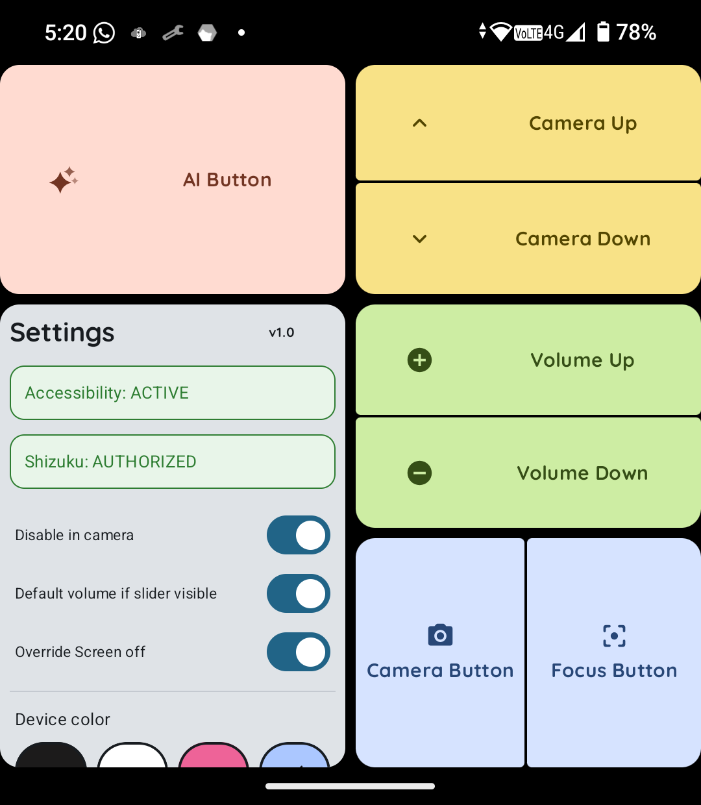 Main Dashboard | 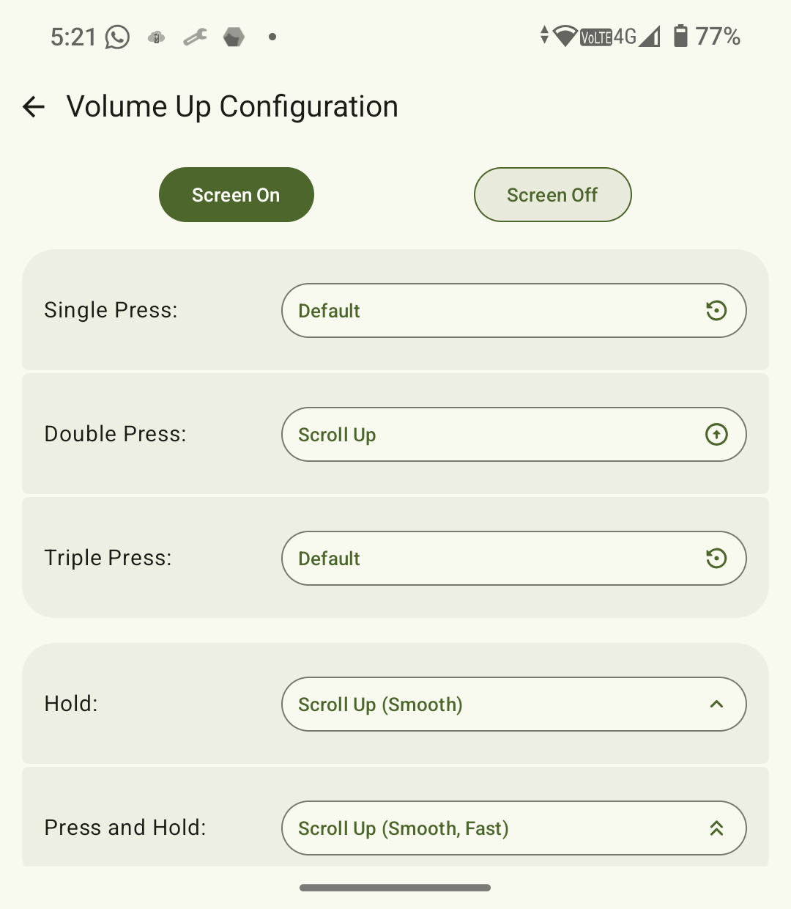 Buttonconfig Screen | 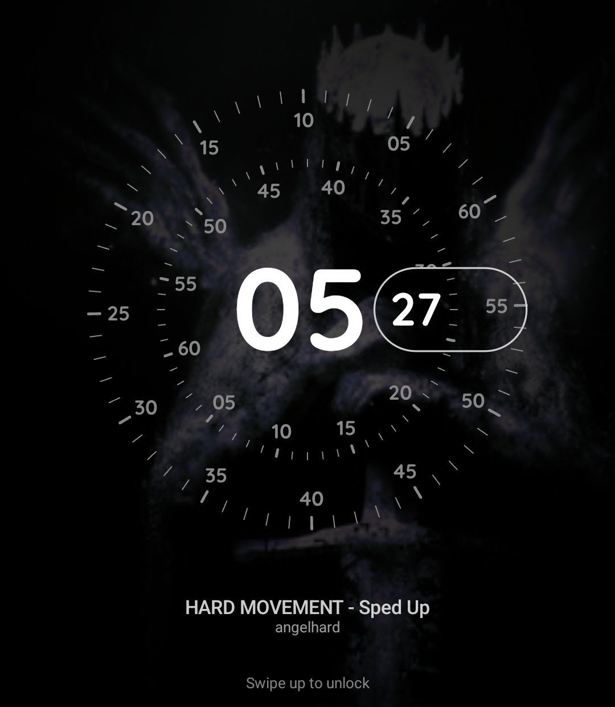 Concentric screen with Mediaplayer |
| 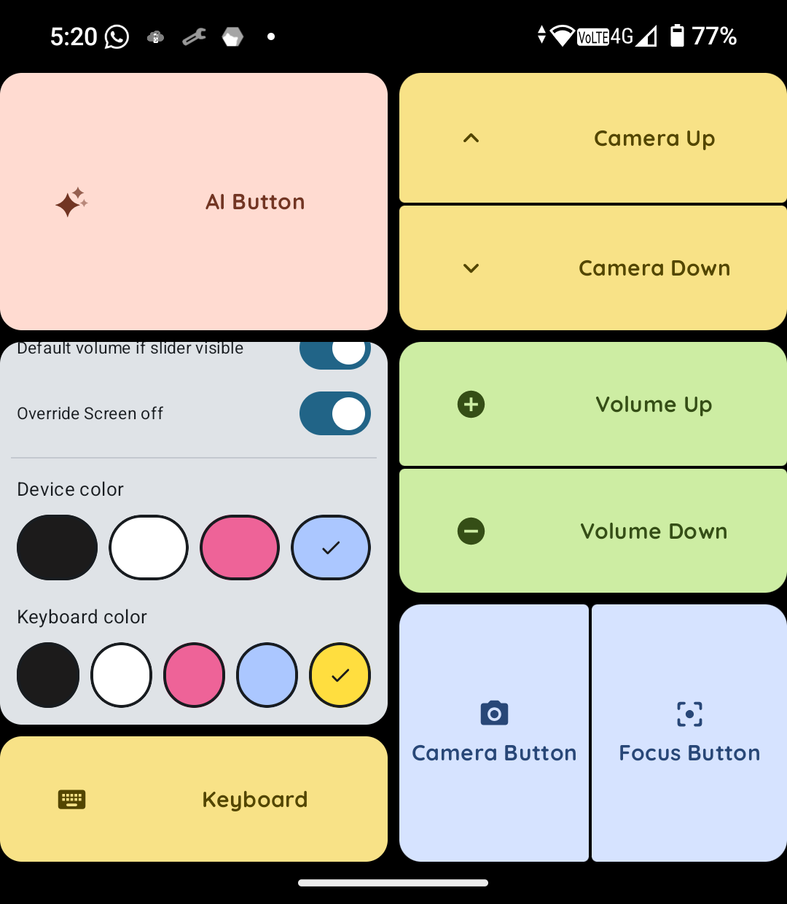 Theme selector and Keyboard button | 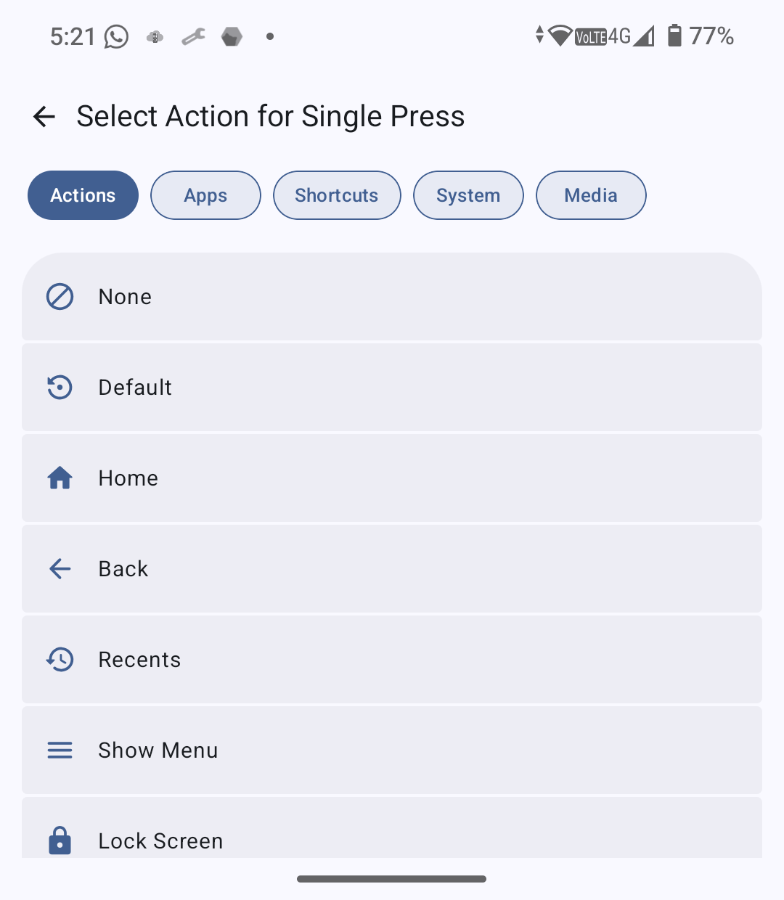 Action selector | 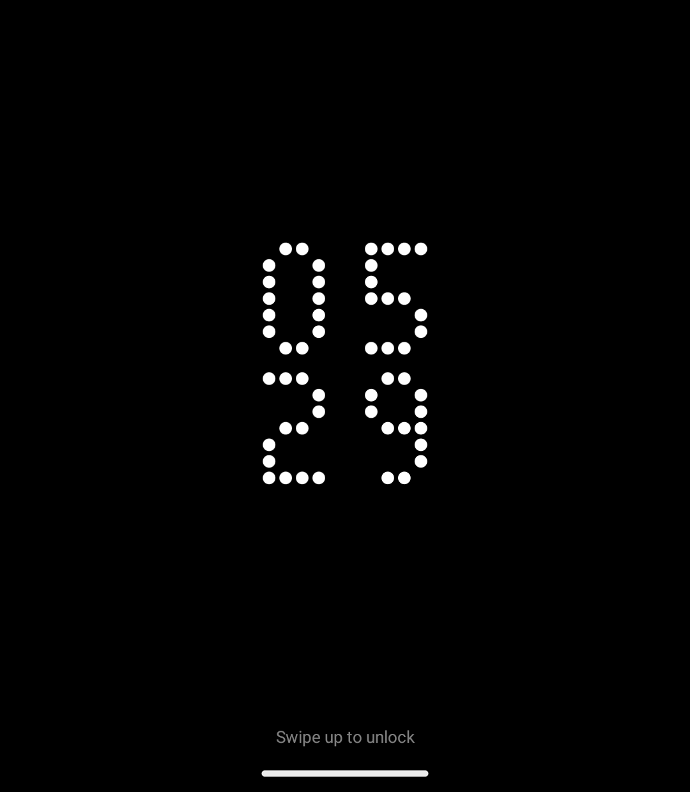 Nothing Dot Stacked |
| 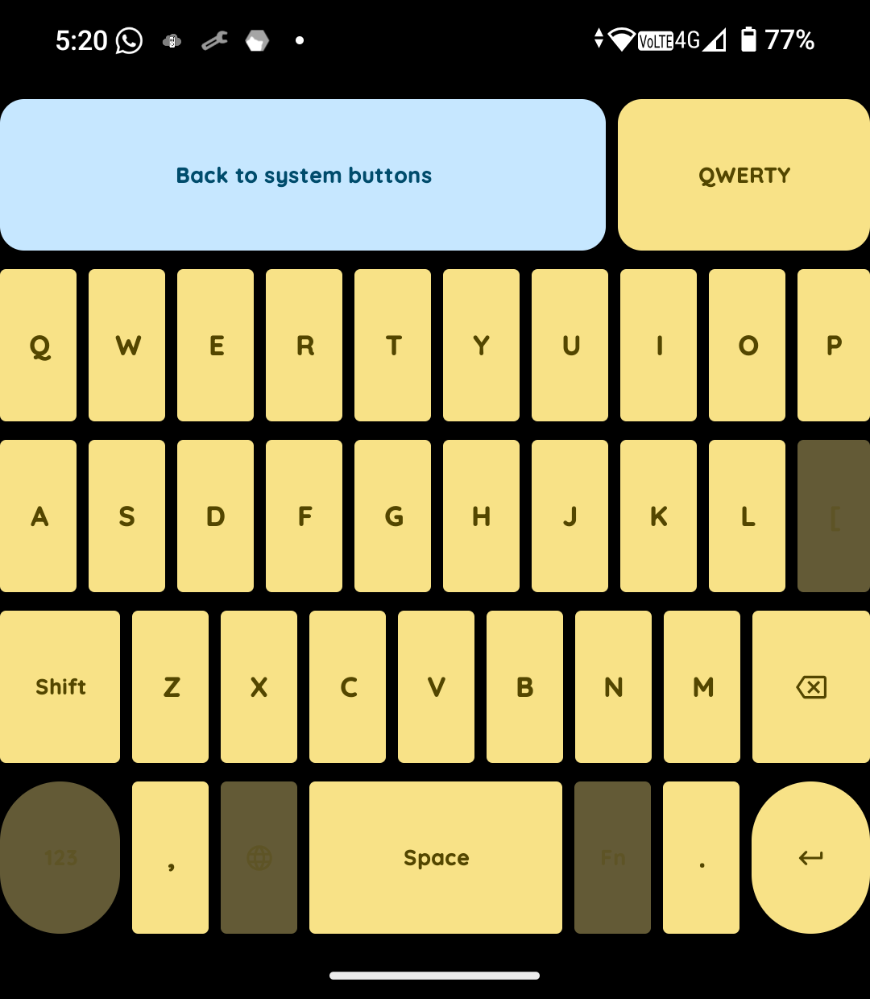 Keyboard Dashboard | 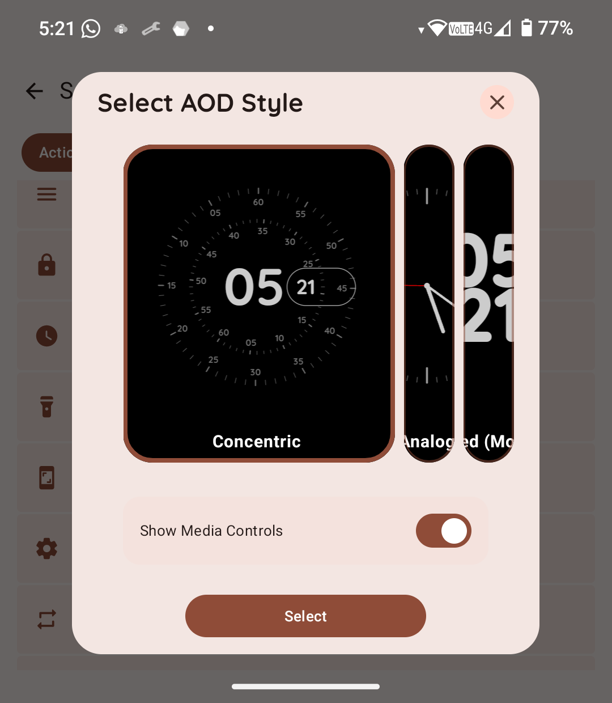 AOD Select Action | 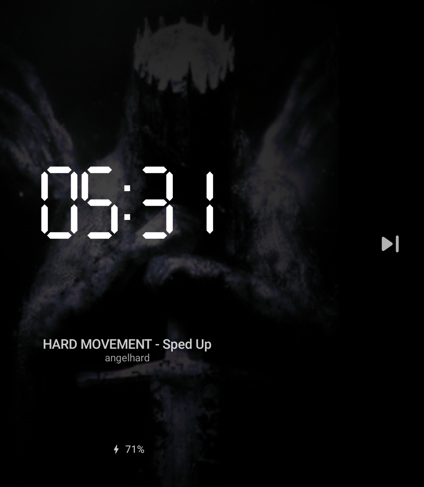 Digital AOD With Media action triggered and charging state |
| | 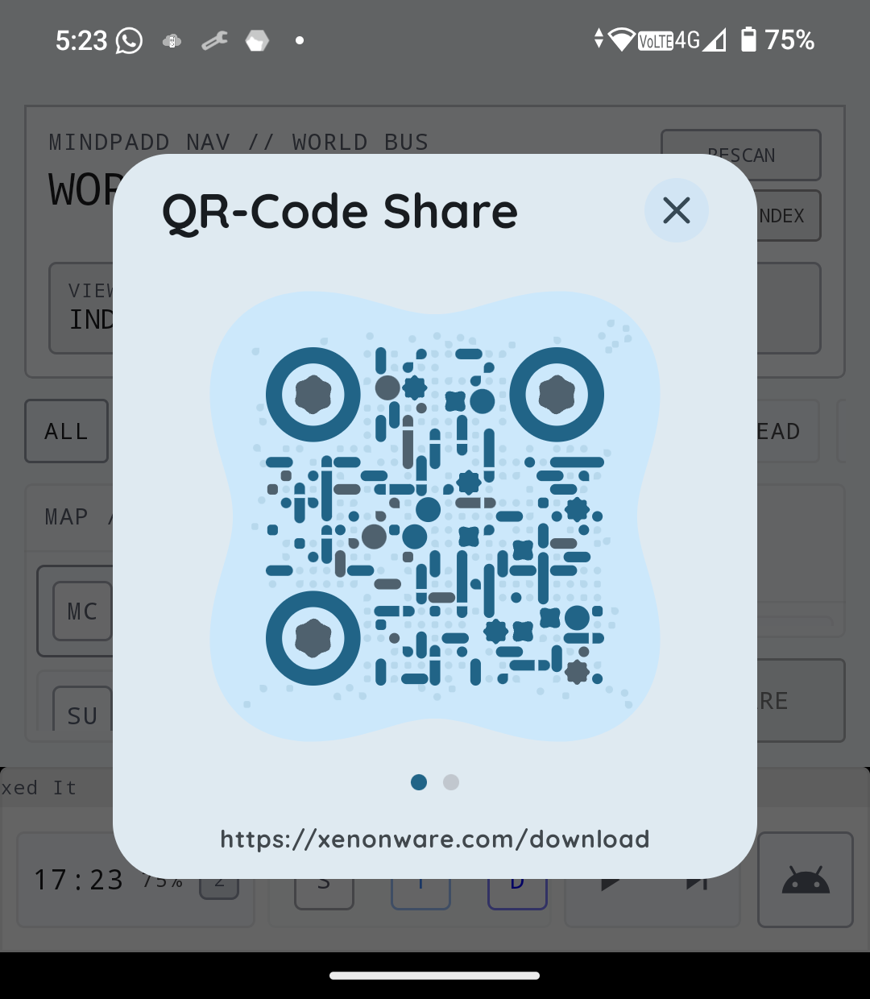 QR-Code dialog | |

---

## 🚀 Key Features

### 1. Dual Privileged Engine (Shizuku & Root)
MindControl v2.0 introduces native support for both **Shizuku** and **Root** (KernelSU, Magisk, APatch, and standard `su`):
*   **Zero UI Blocking:** Permission detection runs reactively via background Kotlin Coroutines / StateFlows, preventing any frame drops or ANRs.
*   **Screen-Off Remapping via Kernel Monitor:** When the screen is off, standard accessibility services cannot intercept input. MindControl spawns a privileged low-level kernel event monitor (`getevent -l`) that translates raw hardware scancodes (volume rocker, power, camera shutter, two-stage focus sensor, AI buttons) in real time.
*   **Secured System Controls:** Execute system-level tasks without cumbersome permission hoops, such as changing aspect ratios, display density, airplane/mobile data, location, and brightness.

### 2. Physical Button & Trigger Remapping
*   **Hardware Supported:** Volume Rockers, Camera Shutter, Half-press Focus Sensor, Dedicated AI / Assistant buttons, Physical Keyboards, and Camera orientation sensors.
*   **Multi-Trigger Gestures:**
    *   `Single`, `Double`, and `Triple` press patterns.
    *   `Long Press` (Hold) and `Press and Hold` detection.
*   **Contextual States:** Assign distinct behaviors depending on whether the screen is **On** or **Off**.

### 3. Continuum: Continuous Fluid Execution
MindControl includes a **Continuum Engine** for fluid system interactions:
*   **How it Works:** Assign an action to the **Hold** or **Press and Hold** trigger.
*   **Continuous Repeat:** As long as the physical button remains depressed, the assigned action continuously and smoothly repeats (ideal for volume ramping, smooth page scrolling, and fine brightness adjustment).

### 4. Custom Always-On Display (AOD)
A fully custom, low-overhead AOD built with Jetpack Compose. Can be assigned as an action to any button trigger or combination:
*   **Watch Face Styles:**
    *   `Concentric` (Pixel Watch concentric rings)
    *   `Analog` (Classic analog hands with modern dial ticks)
    *   `Planets` (Dynamic orbital visualization)
    *   `Spinner` (Rotating abstract clock indicators)
    *   `Pixel Stacked` & `Pixel Inline` (Retro pixel-art typography)
    *   `Nothing Dot Stacked` & `Nothing Dot Inline` (Signature dot-matrix style)
    *   `Stacked Digital` & `Inline Digital` (Clean modern digital layouts)
    *   `Blocks` & `Bars` (Bold geometric watchfaces)
*   **Dynamic Media Art:** Renders the currently playing album art as a subtle, blurred and vignetted ambient backdrop.
*   **Smart Indicators:** Real-time mirroring of notification tray icons, charging animations, and battery percentage.
*   **Simple Dismissal:** Press power or swipe up to immediately return to your lock screen or desktop.

### 5. Display, Aspect Ratio & Density Customization
Switch display geometry on the fly using physical button mappings:
*   **Aspect Ratios:** Full Screen, 4:3, 16:9, Cycle Aspect Ratio, or Step Up/Down.
*   **Screen Densities (DPI):** Density 300, Density 400, Density Cycle, or apply custom DPI profiles.
*   **Custom Resolutions:** Quickly toggle between native resolution and custom aspect configurations.

### 6. Universal Physical Keyboard Support
*   **Regional Layouts:** Native layout switching for `QWERTY`, `QWERTY (Spanish)`, `QWERTZ` (German/Central European), and `AZERTY` (French).
*   **Visual Key Mapper:** Interactive on-screen keyboard map lets you visualize and bind custom actions to individual physical keys.

### 7. Adaptive Theming & Dynamic Icons
*   **Adaptive App Icons:** The launcher icon dynamically adapts to match your device casing (Black, White, Pink, Blue).
*   **Device & Keyboard Palettes:** Theme both the main interface and physical keyboard mapper to match your hardware style.

---

## 🛠 Action Library (50+ Actions)

<b>Click to expand the available actions</b>

> **Note:** Actions marked with **(Continuum)** support continuous hold execution. Actions marked with **(Privileged)** require Shizuku or Root.

| Category | Actions |
| :--- | :--- |
| **Navigation** | Home, Back, Recents, Last App, Show Menu (Privileged) |
| **Media** | Play/Pause, Next, Previous, Stop, Fast Forward, Rewind, Step Forward/Back, **Volume Up/Down (Continuum)**, Volume Dialog, Mute Volume, Mute Microphone Toggle |
| **Connectivity** | WiFi Toggle (Privileged), Bluetooth Toggle (Privileged), Mobile Data Toggle (Privileged), NFC Toggle (Privileged), Location Toggle (Privileged), Do Not Disturb |
| **Display & Geometry** | Aspect Ratio (Full / 4:3 / 16:9 / Cycle / Up / Down) (Privileged), Screen Size (Full / 4:3 / 16:9 / Custom) (Privileged), Display Density (300 / 400 / Cycle / Custom) (Privileged), **Brightness Up/Down (Continuum)**, Auto-Brightness Toggle (Privileged), Auto-Rotate Toggle, Rotate 360°, Toggle AOD |
| **System** | Flashlight, Screenshot, Lock Screen, Assistant, Power Dialog, Notifications Panel, Quick Settings Panel, Cycle Sound Mode, Vibrate Ringer |
| **Navigation & Scroll** | **Scroll Up/Down (Continuum)**, **Smooth Scroll Normal/Fast (Continuum)**, Copy, Cut, Paste, App Info, Google Search |
| **Custom & Shortcuts** | Launch App, Launch Custom Shortcut, Speed Dial, Open Custom URL, Show QR Code Dialog |

---

## 🏗 Technical Architecture

1.  **Accessibility Key Filtering:** Intercepts key events using `AccessibilityService.FLAG_REQUEST_FILTER_KEY_EVENTS` when the screen is active.
2.  **Kernel Event Monitoring:** When the screen turns off, MindControl falls back to reading raw scancodes via `/system/bin/getevent -l` through Shizuku or Root, ensuring reliable triggers even under aggressive OEM sleep states.
3.  **Device-Protected Storage (`Direct Boot`):** User configurations and root statuses are kept in encrypted device-protected storage (`createDeviceProtectedStorageContext()`), allowing MindControl to initialize and function immediately upon boot before the first user unlock.
4.  **Local & Reactive Architecture:** State is driven by Kotlin Coroutines `StateFlow` and Jetpack Compose without polling loops or blocking threads.

---

## 📥 Installation & Setup

1.  **Install the APK** from the [Releases](https://github.com/Dinico414/MindControll/releases) page.
2.  **Enable Accessibility Service:** Open `Settings > Accessibility > MindControl` and toggle it ON. (If greyed out on Android 13+, tap the 3 dots in App Info and choose *"Allow restricted settings"*).
3.  **Privileged Access (Recommended):**
    *   **Root:** If your device is rooted (KernelSU / Magisk / APatch), grant root access when prompted or from your root manager.
    *   **Shizuku:** If unrooted, launch [Shizuku](https://shizuku.rikka.app/) and authorize MindControl.
4.  **Battery Optimization:** Exclude MindControl from battery optimization to keep the background monitoring service persistent.
5.  **Notification Listener (Optional):** Enable notification access to display media controls and notification badges on the AOD.

---

## 🛡 Privacy & Security

*   **No Internet Access:** MindControl requests **zero** network permissions (`android.permission.INTERNET` is not included in the manifest). All data, actions, and key events stay strictly on your device.
*   **No Analytics or Tracking:** No telemetry, third-party trackers, or cloud dependencies.
*   **Open Source:** Full source code is open and verifiable.

---

## ☕ Support the Project

If you find MindControl helpful, consider supporting its development!

  

---

## 👨‍💻 Developer & Credits
*   **Company:** Xenonware
*   **Lead:** Nico ([Dinico414](https://github.com/Dinico414))

---
*Disclaimer: This application uses Accessibility Services and privileged shell APIs. It is an independent project by Xenonware and is not affiliated with Nothing Technology Ltd., iKKO, Google LLC, or any OEM.*
